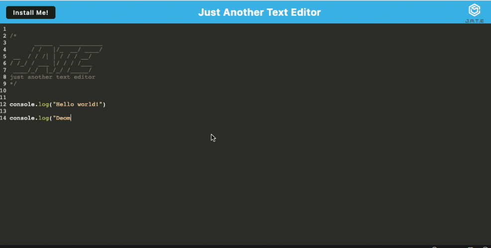

# 19 Progressive Web Applications (PWA): Text Editor

## Description

As you have progressed through this course, you have put together a number of impressive projects that you can show off to potential employers. This project is no exception; in fact, it features some of the most impressive expressions of the concepts you have learned so far.

Your task is to build a text editor that runs in the browser. The app will be a single-page application that meets the PWA criteria. Additionally, it will feature a number of data persistence techniques that serve as redundancy in case one of the options is not supported by the browser. The application will also function offline.

To build this text editor, you will start with an existing application and implement methods for getting and storing data to an IndexedDB database. You will use a package called `idb`, which is a lightweight wrapper around the IndexedDB API. It features a number of methods that are useful for storing and retrieving data, and is used by companies like Google and Mozilla.

You will deploy this full-stack application to Heroku using the [Heroku Deployment Guide on The Full-Stack Blog](https://coding-boot-camp.github.io/full-stack/heroku/heroku-deployment-guide).

**Important**: Make sure your submission includes the `.npmrc` file in this starter code.  This will ensure your application will deploy properly to heroku.

## User Story

```md
AS A developer
I WANT to create notes or code snippets with or without an internet connection
SO THAT I can reliably retrieve them for later use
```

## Acceptance Criteria

```md
GIVEN a text editor web application
WHEN I open my application in my editor
THEN I should see a client server folder structure
WHEN I run `npm run start` from the root directory
THEN I find that my application should start up the backend and serve the client
WHEN I run the text editor application from my terminal
THEN I find that my JavaScript files have been bundled using webpack
WHEN I run my webpack plugins
THEN I find that I have a generated HTML file, service worker, and a manifest file
WHEN I use next-gen JavaScript in my application
THEN I find that the text editor still functions in the browser without errors
WHEN I open the text editor
THEN I find that IndexedDB has immediately created a database storage
WHEN I enter content and subsequently click off of the DOM window
THEN I find that the content in the text editor has been saved with IndexedDB
WHEN I reopen the text editor after closing it
THEN I find that the content in the text editor has been retrieved from our IndexedDB
WHEN I click on the Install button
THEN I download my web application as an icon on my desktop
WHEN I load my web application
THEN I should have a registered service worker using workbox
WHEN I register a service worker
THEN I should have my static assets pre cached upon loading along with subsequent pages and static assets
WHEN I deploy to Heroku
THEN I should have proper build scripts for a webpack application
```

## Mock-Up

The following animation demonstrates the application functionality:



## Motivation

I was motivated to complete this assignment to learn more about the popular coding archetechture, a single-page application that meets the PWA criteria. Additionally, it will teach me how to use a number of data persistence techniques that serve as redundancy in case one of the options is not supported by the browser. The application will also function offline.

## Why

I wanted to further my knowledge of JavaScript libraries and frameworks, and learn how to use a packages like idb, webpack, and babel with the Indexedb API as the database. It allows for installing locally and functioning offline. This PWA also features a number of methods that are useful for storing and retrieving data, and is used by companies like Google and Mozilla.

## What problem does it solve?

This project solves the problem of data persistence, and offline functionality. This solves the problem of functioning even when offline by using a database API called Indexedb, packages like idb, webpack, and babel. It allows the user to install the app for offline functionality including the ability to save to the API database to allow for rendering saved data during offline use when connecting back to the internet. This PWA features a number of methods that are useful for storing and retrieving data, and is used by companies like Google and Mozilla.

## What did you learn?

I learned how to structure a PWA, and how to use a number of data persistence techniques that serve as redundancy in case one of the options is not supported by the browser. The application will also function offline. I learned how to use a packages like idb, webpack, and babel with the Indexedb API as the database. This taught me how to build an app that can function both online and offline.

## Installation

first type npm install in the terminal, then npm run start in the terminal to start the server, then go to localhost:3001 in the browser to view the app.

## Usage

This app can be used to create and save notes, and code snippets. It can be used to save data to a database, and render that data on or offline.

### Link to github repo

<https://github.com/precisecoding/PWA>

### Deployed link


### This site was built using netlify and render

Render:
<https://render.com/>

### License

MIT License:
<https://opensource.org/licenses/MIT>
<https://choosealicense.com/licenses/mit/>
LICENSE file included in repository.

### Thanks to everyone for support and contributions

Sources used: <https://developer.mozilla.org/en-US/>, <https://www.w3schools.com/>, <https://stackoverflow.com/>.